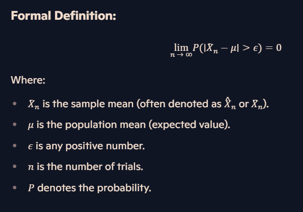

### The Law of Large Numbers

The Law of Large Numbers (LLN) is a theorem that describes how the average of a large number of trials converges to the expected value as the number of trials increases. In simpler terms, as you repeat an experiment more and more times, the average result will get closer to the expected outcome.

#### Formula:

Where:
- \(\bar{X}_n\) is the sample mean (often denoted as \( \hat{X}_n \) or \( \overline{X}_n \)).
- \(\mu\) is the population mean (expected value).
- \(\epsilon\) is any positive number.
- \(n\) is the number of trials.
- \(P\) denotes the probability.

#### Explanation:

1. **Sample Mean (\(\bar{X}_n\))**:
   - This is the average value of the sample data. It's computed as:
     

\[ \bar{X}_n = \frac{1}{n} \sum_{i=1}^{n} X_i \]

     where \(X_i\) are the individual sample values, and \(n\) is the sample size.

2. **Population Mean (\(\mu\))**:
   - This is the true average value of the entire population from which the sample is drawn. It's also called the expected value.

3. **\(\epsilon\)**:
   - This represents a margin of error or a threshold. It's a positive number that specifies how close we want the sample mean to be to the population mean.

4. **Number of Trials (\(n\))**:
   - This refers to the number of observations or samples.

5. **Probability (\(P\))**:
   - This is the likelihood that a certain event will occur.

#### What the Formula Means:

The formula states that as the number of trials \(n\) approaches infinity, the probability that the absolute difference between the sample mean \(\bar{X}_n\) and the population mean \(\mu\) exceeds \(\epsilon\) approaches zero.

In simpler terms, the more samples we take:
- The closer the sample mean (\(\bar{X}_n\)) gets to the population mean (\(\mu\)).
- The less likely it is that the sample mean will deviate significantly from the population mean by more than \(\epsilon\).

#### Visualising the Concept:

1. **Small Number of Trials**:
   - When \(n\) is small, the sample mean (\(\bar{X}_n\)) may fluctuate widely around the population mean (\(\mu\)).
   - The probability that \(| \bar{X}_n - \mu | > \epsilon\) is higher.

2. **Large Number of Trials**:
   - As \(n\) increases, the fluctuations of the sample mean around the population mean decrease.
   - The probability that \(| \bar{X}_n - \mu | > \epsilon\) approaches zero.
   - This means the sample mean becomes a more accurate estimate of the population mean.

#### Practical Implications:

This principle assures us that with a large enough sample size, statistical estimates (like the mean) become reliable reflections of the population parameters. It's the reason why large datasets provide more reliable and valid inferences than smaller ones.
